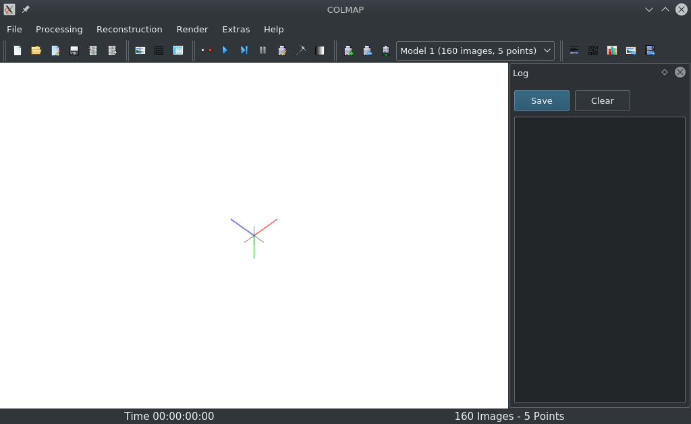
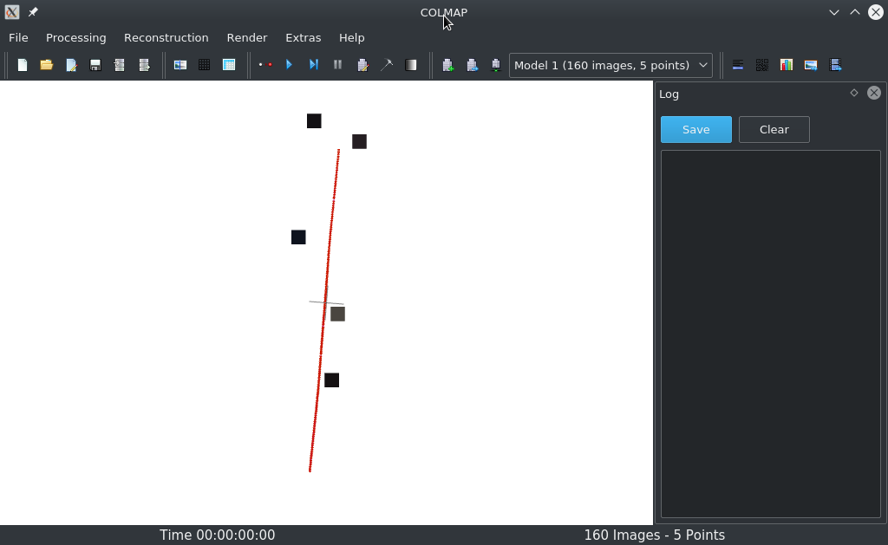
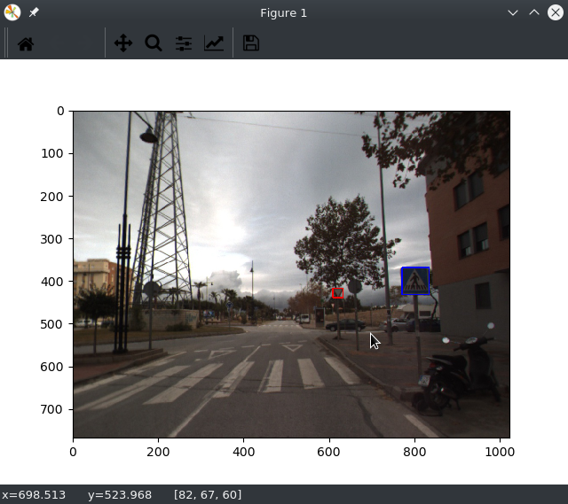
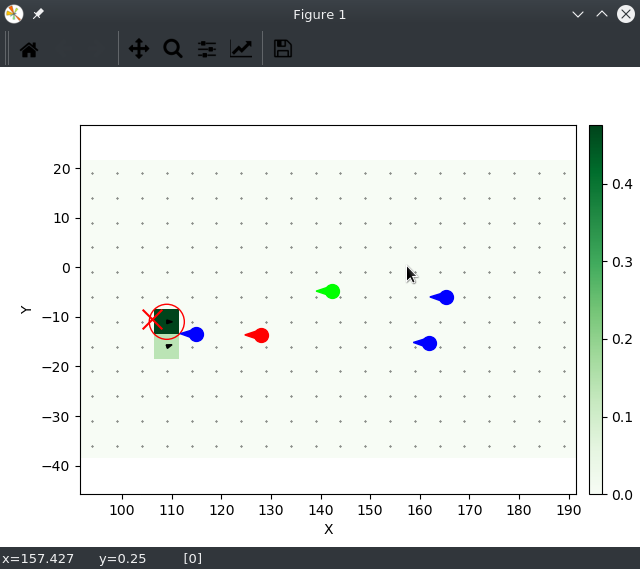
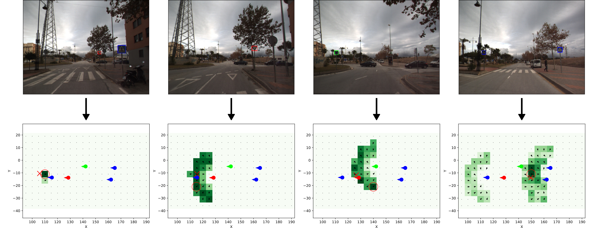
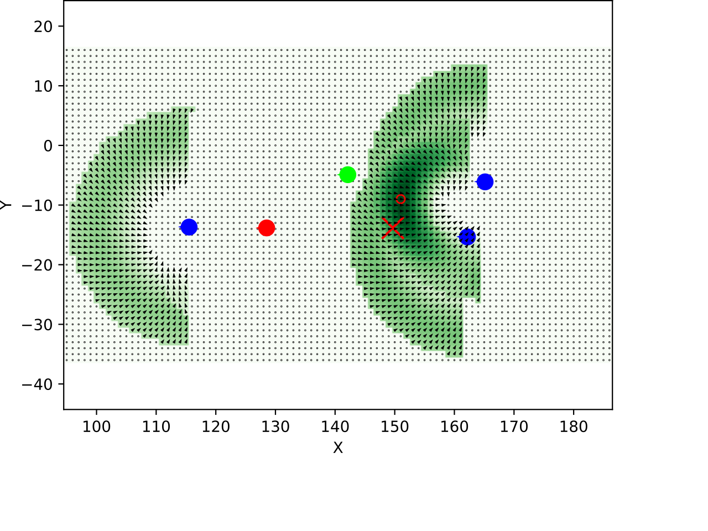

# Project Description

In this project we developed a visual localization pipeline based on semantic features.
As semantic features we chose traffic signs.
In theory, any kind of semantic feature which can be detected can be integrated into this pipeline.
As traffic signs or other semantic features may occur only sparsely in the environment, this localization pipeline cannot give a good pose estimate on its own.
In that case, the idea is that this pipeline can be used to generate a set of good starting points which other localization pipelines can use to localize more efficiently.

# Project Files

This is a description of all the files of the project.

```
code/
├── data/
│   ├── mapping images/ ............. A subset of the Malaga Urban Dataset that is used to create the map in the demo.
│   ├── query images/ ............... Hand-picked files from the Malaga Urban Dataset that can be used as query images in the demo.
│   ├── templates/ .................. Traffic sign templates used for template matching
│   ├── transformation_matrices/ .... Tranformation matrices to tranform various routes into the map frame. Not important.
│   ├── transformed_routes_gps/ ..... Tranformed GPS data of various routes. Not important.
│   └── detections.pickle ........... Pre-computed traffic sign detections. Can be used to skip the detection step in the demo.
├── scripts/ ........................ Auxiliary scripts we created during development. Not important.
├── colmap_database.py .............. COLMAP database script. See link below.
├── detection.py .................... Module for detecting traffic signs in images.
├── evaluate.py ..................... Module for generating evaluation graphs for large sets of query images. Not relevant for the demo.
├── ground_truth_estimator.py ....... Module for estimating ground truth poses for images from GPS and IMU data.
├── images.py ....................... Utility functions for images.
├── localization.py ................. Module to localize query images.
├── mapping.py ...................... Module for map creation.
├── matching.py ..................... Module for matching detections between frames.
├── prediction.py ................... Module for calculating the expected view of the mapped landmarks from a given pose.
├── score.py ........................ Module for calculating the match score of expected and actual view.
├── triangulation.py ................ Module for generating the map with COLMAP.
└── util.py ......................... General utility functions.
report/ ............................. Final project report.
```
[Link to COLMAP database script](https://github.com/colmap/colmap/blob/dev/scripts/python/database.py)

# Running the Demo

The demo consists of two steps: _map creation_ and _localization_.
During map creation a map of landmarks (traffic signs) is created which will be used in the localization step to estimate the pose of a query image.

[COLMAP](https://github.com/colmap/colmap) is used during the map creation step.
You will need to install it as instructed on their project page.
For our testing we used the version `COLMAP 3.6 -- Commit ad7bd93 on 2020-03-07 without CUDA`.
We also used the following libraries and tools:

Library      | Version  | Link
------------ | -------- | -------------------------------------------------------
Python       | `3.7.7`  | [link](https://www.python.org/)
Numpy        | `1.17.4` | [link](https://numpy.org/)
Matplotlib   | `3.1.3`  | [link](https://matplotlib.org/)
OpenCV       | `3.4.8`  | [link](https://opencv.org/)
Transforms3d | `0.3.1`  | [link](https://github.com/matthew-brett/transforms3d)
scikit-learn | `0.21.3` | [link](https://scikit-learn.org/)
SciPy        | `1.4.1`  | [link](https://www.scipy.org/)

## Map creation

A map is created from an set of mapping images. For the demo, such a set is provided in `code/data/mapping images/`.
To create the map from that set, you first need to set the path to the COLMAP executable.
This is done by setting the `COLMAP_EXECUTABLE_PATH` variable at the top of `code/mapping.py`.
If COLMAP is installed on your system you can find the path to the executable by running `whereis colmap`.
Maybe sure that the path you set really contains the correct COLMAP version.
For example, if you set the path to COLMAP to `/path/to/colmap` make sure you are checking the version by running `/path/to/colmap help`

Then simply go into the `code` directory with `cd code` and run the command:
```
python3 mapping.py
```
The script will automatically use the provided mapping image set.
It will start detecting the traffic signs in each mapping image.
In the process it will save debug images in `code/output/detection_debug` that visualize the detections for each processed image.
As there are 160 images in the demo set this will take a while.
After the script is done, it will save the detections to the file `code/output/detections.pickle` and when running the script in the future it will read the detections from that file, which will be much faster.

**If you do not want to wait** you may copy the file `code/data/detections.pickle` into the output directory.
This file contains pre-computed traffic sign detections for each image.
However, detection debug images will not be availabe in that case.

After all the images where processed by the detection module, the detections will be matched between the images.
This does not take long.

Lastly, the detections and the matches will be fed into COLMAP which will use that information to triangulate the positions of the traffic signs in 3D space.
This does not take long as well.

When COLMAP is done, the COLMAP GUI will be opened, which will look like this:


The part of the route that is being mapped by the provided mapping images is not very close to the origin of the coordinate system, which is why there is nothing to see in the initial view.
To see the mapped images, zoom out using your mouse wheel.
As you zoom out, a red line will become visible.
You can pan it into view by pressing `CTRL` and dragging the 3D view around with your mouse.
When pressing `CTRL` and using your mouse wheel, you can increase the size of the 3D points that where triangulated by COLMAP.

If you adjust everything well, it will look like this:


Each of those grey points represents a traffic sign in the mapped environment and each of the red shapes represents an image that was used for mapping.
By double-clicking on one of the grey points, it is possible to see more details about the point.
There, you are able to see from which images and where in those images the point has been seen (green X).
It will also show the reprojected point for each image (red circles).

To finish the execution of the script, close the COLMAP GUI.
A prompt will appear asking if you want to save the project. Press `No`.
Then a prompt will appear asking if you really want to quit. Press `Yes`.

When the GUI is closed the mapping script will do a few last calculations (like the direction for each traffic sign) and finally save the landmark map to `output/map.pickle`.
This is the map which can be used to localize query images.

## Localization

To localize a query image, the variable `QUERY_IMAGE_PATH` at the top of `code/localization.py` needs to be set to the path to the query image.
There are four different query images available for the demo in `code/data/query images`.
Their paths are already in the localization script.
Simply uncomment the line for the query image that you would like to localize.

To run the localization, make sure you are in the `code` directory and run the command:
```
python3 localization.py
```

The script will first run the detection again on the single query image.
This will take a few seconds.
When the detection is completed, a plot will open showing the detected traffic signs in the query image:


After the plot is closed, the query image will be localized based on those detections.
This will again take a few seconds. The progress will be shown.

Afterwards, a heatmap will be opened which visualized the match score for each position around the traffic signs.


The pose with the highest score that was found for the query image is surrounded by a red circle.
The actual pose, estimated by the GPS data is shown with a red X.
The small black arrows indicate the most likely orientation for a given position.

Here are all the localization results of the provided query images:


Granularity can be adjusted by setting the variables `POSITION_STEP_SIZE` and `ANGLE_STEP_SIZE`.
Here an example with `POSITION_STEP_SIZE = 1` and `ANGLE_STEP_SIZE = 1`, which takes a lot more time to calculate:

